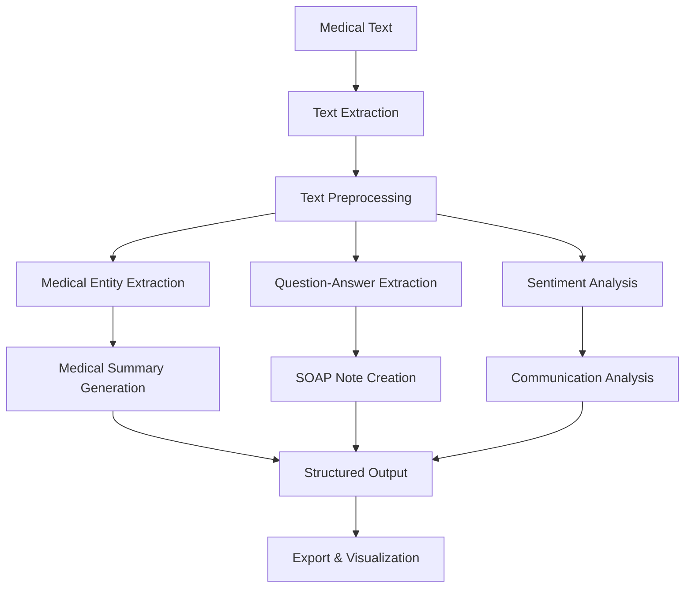

# AI Clinical Intelligence Platform

#### Demo["https://emitrr-sjqi.onrender.com"]

## Overview

The AI Clinical Intelligence Platform is an advanced medical transcript analysis system that transforms clinical conversations into structured documentation using state-of-the-art Natural Language Processing (NLP) and Machine Learning techniques. The platform automatically extracts medical entities, generates SOAP notes, performs sentiment analysis, and provides comprehensive quality metrics for healthcare documentation.

##  Features

- **📋 Medical Entity Extraction**: Automatically identifies symptoms, conditions, medications, procedures, and body parts
- **🏥 SOAP Note Generation**: Creates structured clinical documentation following medical standards
- **😊 Sentiment Analysis**: Analyzes patient emotional state and communication effectiveness
- **📊 Quality Metrics Dashboard**: Provides comprehensive analytics on clinical conversations
- **📄 Multi-format Support**: Handles TXT and DOCX file uploads
- **💾 Export Capabilities**: Downloads individual reports or complete analysis packages in json format.
- **🎨 Modern UI**: Beautiful, responsive interface with medical-themed design

##  Project Architecture

```
NLP/
│
├── app.py                     # Main Streamlit application
├── requirements.txt           # Python dependencies
├── .env                      # Environment variables (HF API token)
├── .gitignore               # Git ignore file
├── README.md                # Project documentation

```

## Algorithms & Technologies Used

### Core NLP Models

1. **Biomedical Named Entity Recognition (NER)**
   - Model: `d4data/biomedical-ner-all`
   - Purpose: Extracts medical entities (symptoms, conditions, medications, procedures)
   - Algorithm: BioBERT-based transformer model fine-tuned on medical texts

2. **Question Answering System**
   - Model: `deepset/roberta-base-squad2`
   - Purpose: Extracts specific clinical information (chief complaint, diagnosis, treatment plan)
   - Algorithm: RoBERTa transformer optimized for extractive QA tasks

3. **Zero-Shot Classification**
   - Model: `facebook/bart-large-mnli`
   - Purpose: Categorizes medical content and intentions
   - Algorithm: BART encoder-decoder with natural language inference

4. **Sentiment Analysis**
   - Model: `cardiffnlp/twitter-roberta-base-sentiment-latest`
   - Purpose: Analyzes patient emotional state and communication patterns
   - Algorithm: RoBERTa fine-tuned for sentiment classification

### Data Processing Pipeline



### Technical Components

- **Frontend**: Streamlit with custom CSS styling
- **Backend**: Python-based NLP processing pipeline
- **APIs**: Hugging Face Inference API
- **Data Formats**: JSON, TXT, DOCX
- **Deployment**: Streamlit Cloud

## Requirements


### Python Dependencies
```
streamlit>=1.28.0
requests>=2.31.0
python-dotenv>=1.0.0
python-docx>=0.8.11
pandas>=2.0.0
numpy>=1.24.0
```

## 🛠️ Installation & Setup

### 1. Clone the Repository
```bash
git clone https://github.com/vinu0404/NLP.git
cd NLP
```

### 2. Create Virtual Environment
```bash
# Using venv
python -m venv clinical_env
source clinical_env/bin/activate  # On Windows: clinical_env\Scripts\activate

```

### 3. Install Dependencies
```bash
pip install -r requirements.txt
```

### 4. Environment Configuration

Create a `.env` file in the project root:
```env
# Hugging Face API Token (Required for full functionality)
HF_API_TOKEN=your_huggingface_api_token_here

```

### 5. Get Hugging Face API Token

1. Visit [Hugging Face](https://huggingface.co/)
2. Create an account or sign in
3. Go to Settings → Access Tokens
4. Create a new token with `read` permissions
5. Copy the token to your `.env` file

### 6. Run the Application
```bash
streamlit run app.py
```

The application will be available at `http://localhost:8501`

##  Usage Guide

### 1. Input Methods

**File Upload**:
- Supported formats: TXT, DOCX
- Maximum size: 50MB
- Encoding: UTF-8

**Text Paste**:
- Direct text input in sidebar
- Real-time character count
- Format validation

**Sample Transcript**:
- Pre-loaded medical conversation
- Demonstrates all features
- Perfect for testing

### 2. Analysis Process

1. **Load Transcript**: Choose input method and load your medical transcript
2. **Configure Analysis**: Select desired analysis types from sidebar
3. **Run Analysis**: Click "Analyze Transcript" button
4. **Review Results**: Explore metrics, summaries, and detailed reports
5. **Export Data**: Download individual reports or complete package

### 3. Expected Input Format

```
Patient: Hello, I've been having headaches for about a week.

Physician: Can you tell me more about these headaches?

Patient: It's a throbbing pain on the right side, and I feel nauseous.

Physician: Based on your symptoms, this sounds like migraines...
```

## 🔧 Configuration Options

### API Configuration
```python
# In app.py, modify these settings:
API_URLS = {
    "ner": "https://api-inference.huggingface.co/models/d4data/biomedical-ner-all",
    "qa": "https://api-inference.huggingface.co/models/deepset/roberta-base-squad2",
    "zero-shot": "https://api-inference.huggingface.co/models/facebook/bart-large-mnli",
    "sentiment": "https://api-inference.huggingface.co/models/cardiffnlp/twitter-roberta-base-sentiment-latest"
}
```